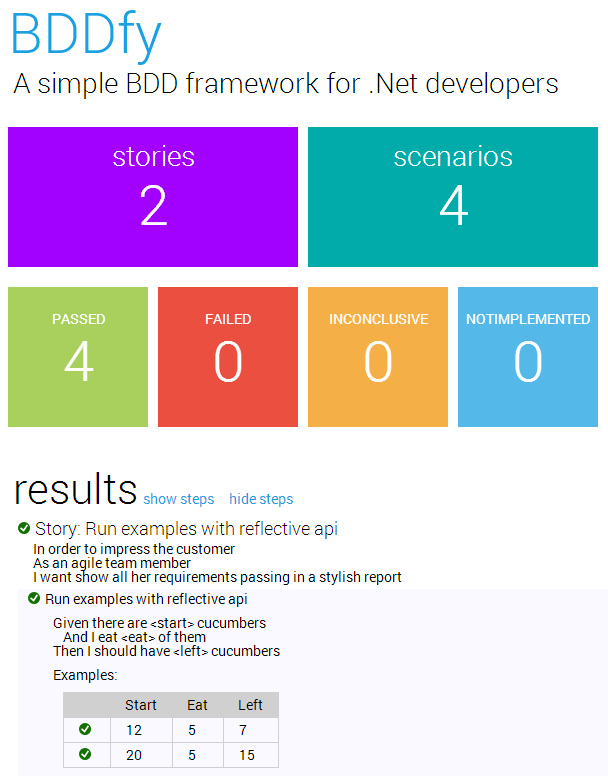
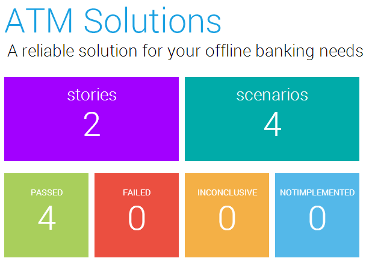

BDDfy v4 is out and it provides a new metro-style HTML report. It has the same functionality as the original HTML report, which is still available, so it just gives you another choice of style for your HTML report. And, of course, you can always customize the CSS and JavaScript of both reports if you want to create a new HTML report with your own look and feel. The way that you customize the metro report is slightly different from how you customize the classic HTML report so I thought I would document that here.
<!--excerpt-->

By default, BDDfy still runs with the classic HTML report. If you want to turn on the metro report, then you need to enable it:

	Configurator.BatchProcessors.HtmlMetroReport.Enable();

Technically, this will mean that both HTML reports are turned on. Be warned though, by default both reports generate a file in your bin directory named `BDDfy.html`. So, one of the files will overwrite the other one and you will only see one HTML report (we might change this). 

If you only want to run the metro HTML report, then you can turn off the classic HTML report:

	Configurator.BatchProcessors.HtmlReport.Disable();

Alternatively, you can customize the metro report to, amongst other things, have a new filename. In this case, instead of enabling the metro report, you would add a new `HtmlReporter` to the Batch Processors pipeline.

    Configurator.BatchProcessors.Add(
        new HtmlReporter(
            new CustomMetroHtmlReportConfiguration(), new MetroReportBuilder()));

Note the use of the `MetroReportBuilder` class to create a custom metro report. (To customize the classic HTML report you could swap that parameter for the `ClassicReportBuilder` class, or use the original constructor overload to leave the ReportBuilder out altogether).

You customise both HTML reports by creating an implementation of `IHtmlReportConfiguration`. The easiest way to do this is to inherit from the `DefaultHtmlReportConfiguration` class and override the specific properties that you want to customize. 

    public class CustomMetroHtmlReportConfiguration : DefaultHtmlReportConfiguration
    {
        public override string OutputFileName
        {
            get { return "BDDfyMetro.html"; }
        }

        public override string ReportHeader
        {
            get { return "ATM Solutions"; }
        }

        public override string ReportDescription
        {
            get { return "A reliable solution for your offline banking needs"; }
        }

        /// Embed jQuery in the report so people can see it with no internet connectivity
        public override bool ResolveJqueryFromCdn
        {
            get { return false; }
        }
    }

